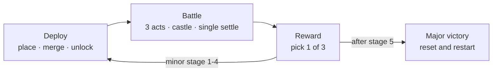
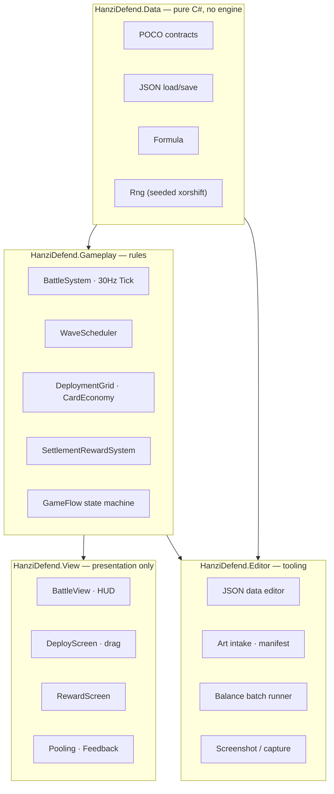

# HanziDefend · 汉字·兵器三国

> A portrait-mode Unity 2D **merge-and-defend auto-battler** where every unit *is* the Chinese
> character that names it. Deploy weapon cards on a 7×7 field, merge duplicates, then watch the
> barracks pour troops at a Three-Kingdoms castle.

**English** · [简体中文](README_Zh.md)

| | |
|---|---|
| **Engine** | Unity `6000.3.11f1` + URP (2D Renderer) |
| **Target** | WeChat Mini Game (portrait 1080×1920, PPU 100) |
| **Milestone** | **M1 — full battle demo**: `Deploy → Battle → Reward` closed loop, 5 minor stages |
| **State** | Playable end-to-end. Balance not yet converged — see [Known gaps](#known-gaps) |
| **Code** | ~44.5k lines of C# across 115 files (≈14.5k of it tests) |

<table>
<tr>
<td width="50%"></td>
<td width="50%"></td>
</tr>
<tr>
<td align="center"><b>Pre-battle deployment</b> — mixed footprints, four merge tiers</td>
<td align="center"><b>Battle</b> — siege fire landing on the enemy castle</td>
</tr>
</table>

---

## Table of contents

- [The loop](#the-loop)
- [Systems](#systems)
- [Combat math](#combat-math)
- [Roster](#roster)
- [Architecture](#architecture)
- [Tooling](#tooling)
- [Tests](#tests)
- [Running it](#running-it)
- [Repository layout](#repository-layout)
- [Known gaps](#known-gaps)
- [Roadmap](#roadmap)

---

## The loop

One **major stage** is five **minor stages**. Coins, the board and earned buffs carry across minor
stages; a major stage resets everything.



<table>
<tr>
<td width="25%"></td>
<td width="25%"></td>
<td width="25%"></td>
<td width="25%"></td>
</tr>
<tr>
<td align="center">1 · Stage 1 opens on a 3×3 unlock</td>
<td align="center">2 · Stage 3, field widened, buffs banked</td>
<td align="center">3 · Win → one of three rewards</td>
<td align="center">4 · Five wins → major victory</td>
</tr>
</table>

---

## Systems

### Deployment — a 7×7 field of barracks

The field is **7×7**; a level opens with a **3×3** unlock rect and grows by unlock cards
(7 shapes: 1×1, 2×1, 1×2, 2×2, notched 2×2, 3×1, 1×3), bought with coins, drawn from the hand, or
granted once per minor stage.

Unit cards occupy real footprints — including **two L-shaped units** (`弩车` missing its upper-right
cell, `冲车` missing its lower-left), which are masked and stitched back into one continuous image
rather than drawn as loose tiles. Dragging a card reports its verdict by colour:

<table>
<tr>
<td width="25%"></td>
<td width="25%"></td>
<td width="25%"></td>
<td width="25%"></td>
</tr>
<tr>
<td align="center">green — placeable</td>
<td align="center">gold — merges with the card underneath</td>
<td align="center">red — blocked by another unit</td>
<td align="center">grey — cell not unlocked</td>
</tr>
</table>

Dropping a card onto an identical card of the same level merges it one tier up:
**green → blue → purple → gold**.

**Every occupied cell is a barracks, not a one-shot spawn.** The first unit arrives after the unit's
`cooldown`, and the cell keeps producing on that same cooldown whether or not the previous unit is
still alive. Stacking is bounded by a per-cell live cap keyed to footprint size
(1 cell → 4 alive, 2 cells → 2, 3+ cells → 1; aura units are hard-capped at 1), plus a global
60-unit ally field cap.

### Battle — three acts, one castle, one verdict

* Fixed-step **30 Hz**: `BattleSystem.Tick(1/30f)` is a public method a test can call N times in a
  row. No gameplay lives in `Update()`. The presentation layer interpolates on top.
* Waves are **generated**, not hand-authored: three acts of 26 s / 32 s / 42 s with a 6 s silence
  between acts, per-act armour mix and pressure coefficient. Stage wave sets currently run
  21 / 30 / 37 / 36 / 35 waves.
* The enemy **castle** (`城`) is not a passive base — it shoots (60 dmg, range 7, 30 pierce) and
  enters at the head of act three.
* Targeting is a deterministic pure-C# spatial bucket with 0.2 s retarget throttling, phase-staggered
  across units. Entities carry no `Rigidbody2D` / `Collider2D`.
* **Victory has exactly one exit**: `TrySettle()` decides, then the tick freezes — no second verdict.
* Unit traits implemented: `Charge`, `Trample`, `PiercingShot`, `DeathSpawn`, `FireAura`, `IceAura`.
* Kills drop coins (1 normal / 3 elite / 20 boss) that fund the next deployment round.

### Reward — three cards, one pick

Winning offers three cards weighted 85 buff / 15 active skill. Each slot can be rerolled **once for
free**, and once more per slot through a mock rewarded-ad hook (`MockAdService`) — the monetisation
shape is wired without an SDK.

Skills and buffs are **data, not code**: an effect is a list of ops
(`AddStat`, `Heal`, `Damage`, `GrantShield`, `SpawnUnit`, `ModifyCoins`) against a target selector
(`SelfUnit`, `AllyAll`, `AllyAdjacent`, `EnemyNearest`, `EnemyInRadius`, `EnemyBase`), executed by a
C# interpreter. That is the project's hot-update story for M1: balance and skills ship as JSON.

---

## Combat math

Damage is two layers, deliberately: a **multiplicative** attack-type × armour-type matrix for
discrete counters, plus **additive** bonus-vs terms so multipliers cannot explode.

```
typeMult = matrix[defender.armorType][attacker.atkType]
damage   = max(minimumDamage, (atk × typeMult + bonusVs) × armorScale / (armorScale + armor - pierce))
```

| armour ↓ / attack → | Slash | Blunt | Arrow | Siege |
|---|:--:|:--:|:--:|:--:|
| **Unarmored** | ×2.0 | ×0.5 | ×2.0 | ×0.5 |
| **Light**     | ×1.5 | ×1.0 | ×1.0 | ×1.0 |
| **Heavy**     | ×0.5 | ×2.0 | ×0.5 | ×4.0 |
| **Building**  | ×0.5 | ×1.0 | ×0.25 | ×2.0 |

Every number above lives in `Assets/GameData/economy.json` — nothing is hard-coded in C#.

---

## Roster

**14 ally units**, 3 enemy types, 1 boss, 2 commanders — all defined in `Assets/GameData/units.json`.

| Unit | Cells | Type | Armour | Attack | HP | Dmg | Range | Trait |
|---|:--:|---|---|---|--:|--:|--:|---|
| 卒 `zu` | 1×1 | Infantry | Unarmored | Slash | 70 | 14 | 0.9 | — |
| 弓 `gong` | 1×1 | Infantry | Unarmored | Arrow | 90 | 22 | 4.5 | — |
| 火 `huo` | 1×1 | Special | Light | — | 120 | — | — | FireAura |
| 冰 `bing` | 1×1 | Special | Light | — | 120 | — | — | IceAura |
| 长矛 `mao` | 1×2 | Infantry | Unarmored | Slash | 260 | 33 | 1.4 | — |
| 肉盾 `dun` | 2×1 | Infantry | Light | Blunt | 900 | 24 | 0.9 | — |
| 大刀 `dao` | 2×1 | Infantry | Light | Slash | 420 | 95 | 1.1 | — |
| 轻骑 `qqi` | 2×1 | Cavalry | Light | Slash | 480 | 62 | 1.0 | Charge ×2 |
| 弩兵 `nub` | 1×2 | Infantry | Unarmored | Siege | 330 | 85 | 5.5 | PiercingShot |
| 重骑兵 `zqi` | 3×1 | Cavalry | Heavy | Slash | 1150 | 45 | 1.1 | Trample |
| 铁甲兵 `tie` | 2×2 | Infantry | Heavy | Slash | 1600 | 130 | 1.2 | — |
| 链甲兵 `lia` | 2×2 | Infantry | Heavy | Blunt | 1600 | 130 | 1.2 | — |
| 弩车 `nuc` | 2×2 ⌐ | Special | Unarmored | Siege | 700 | 260 | 7.0 | PiercingShot |
| 冲车 `chc` | 2×2 ⌐ | Special | Heavy | Siege | 1000 | 300 | 1.5 | DeathSpawn ×3 卒 |

Enemies: 狼 `e_lang` (fast, glass), 流寇 `e_liu`, 山贼 `e_shan`. Boss: 城 `bld_cheng` (3600 HP,
armour 40, shoots). Commanders: 刘备 (passive *仁德* +10 % ally ATK, active *仁心济世* heal 100) and
吕布 on the enemy side.

---

## Architecture



Four rules the codebase is held to (see [`AGENTS.md`](AGENTS.md)):

1. **No gameplay rules in the View layer.** The view never computes a number or decides a winner.
2. **One settle exit.** `TrySettle()` is the only verdict, and the tick freezes right after it.
3. **Numbers live in JSON.** `Assets/GameData/*.json` is the single source of truth; no magic
   constants in C#.
4. **All randomness goes through seeded `Data.Rng`.** `UnityEngine.Random` is banned, so a bug
   reproduces and a batch run replays.

Two structural requirements follow from wanting a headless simulator:
`BattleSystem.Tick(float dt)` must be callable in a loop from a test, and the scene is **assembled by
code** — `Battle.unity` holds exactly three objects (`Main Camera`, `Canvas`, `Bootstrap`) and
everything else is built in `Awake`, so there are no scene merge conflicts and no dragged references.
Art binds by convention path through a generated `art_manifest.json`.

---

## Tooling

| Tool | Where | What it does |
|---|---|---|
| **JSON data editor** | `HanziDefend/Data Editor` | `JSON ⇄ shadow ScriptableObject ⇄ Inspector` with schema validation and a save-time diff preview. JSON stays the source of truth. |
| **Art intake pipeline** | `Tools/art_intake.py`, `HanziDefend/Art/Regenerate Manifest` | White-background → alpha matting, naming/aspect validation, atlas-ready import, and `art_manifest.json` generation. No Inspector wiring. |
| **Art background validator** | `HanziDefend/Validate Unit Art Backgrounds` | Rejects unit art by opaque-border ratio *and* canvas coverage — the second metric exists because the first alone missed `弩车`. |
| **Balance batch runner** | `HanziDefend/Balance/Run (25 · 100 per Cohort)` | Headless N-game batches across reference lineups, parallel workers, CSV + markdown reports, and a locked acceptance evaluator (win rate, duration, armour mix, front-line metrics, monotonic difficulty). |
| **Wave generator** | `HanziDefend/Balance/Regenerate Waves` | `waves.json` is a build output: acts, pressure coefficients and armour shares in, 21–37 waves out. |
| **Capture tools** | `HanziDefend/Screenshot`, `Capture Battle Review`, `Capture Queue Review`, `Capture Deploy Drag States` | Deterministic 1080×1920 evidence shots — every screenshot in this README came from them. |
| **Sprite atlas + perf gates** | `SpriteAtlasGenerator`, PlayMode performance tests | Atlas build plus frame-time / GC / scalability gates. |
| **MCP for Unity** | `com.coplaydev.unity-mcp` | The project is built agent-first: work orders, review reports and editor automation all run through MCP. |

---

## Tests

`Assets/Scripts/Tests` — 14 EditMode files + 20 PlayMode files, ~14.5k lines:

* **409** `[Test]` methods, **216** `[TestCase]` rows, **6** `[UnityTest]` coroutine tests.
* EditMode covers config loading and schema, formulas and RNG determinism, the deployment grid,
  card economy, settlement rewards, the art pipeline and the balance runner.
* PlayMode covers battle encounters, traits, feature expansion, the HUD canvas, deploy drag chains,
  card layering/shape/name rendering, game flow, feedback, and pooling.
* Performance tests assert frame time, GC allocation, retarget phase staggering and 200→400 unit
  scalability.

Regression tests here are written to be *provably* load-bearing: work orders record that reverting
the fix turns a stated number of them red (e.g. WO-C11 — 13 of 24 new cases).

---

## Running it

```bash
git clone https://github.com/Mustenaka/HanziDefend.git
```

1. Open the project in **Unity 6000.3.11f1** (Git LFS is required — art and screenshots are LFS).
2. Open `Assets/Scenes/Battle.unity` and press **Play**. `Bootstrap` builds the whole game.
3. You start in Deploy. Drag cards onto the field, then press **战斗**.
4. In battle, `AUTO`/`MANUAL` toggles auto-run and `STEP` advances one tick — the same manual
   stepping the tests use. `M1GameBootstrap.SimulationSpeed` defaults to `8×` for fast iteration.

Useful menu items live under **`HanziDefend/`** in the Unity menu bar.

---

## Repository layout

```
Assets/
  GameData/        units · commanders · waves · levels · effects · economy · art_manifest (JSON)
  Scripts/
    Data/          [HanziDefend.Data]      pure C#: contracts, JSON, formulas, seeded Rng
    Gameplay/      [HanziDefend.Gameplay]  battle, deployment, reward, GameFlow
    View/          [HanziDefend.View]      battle view, deploy screen, HUD, pooling, feedback
    Editor/        [HanziDefend.Editor]    data editor, art pipeline, balance runner, capture
    Tests/         EditMode · PlayMode · Performance
  Art/             units · commanders · buildings · icons · FX · atlases
  Scenes/          Battle.unity (3 objects; everything else is code-assembled)
Docs/
  Plan/            milestone scope, work orders, decisions, tech debt, review reports
  Art/             art spec: canvas sizes, naming, intake pipeline, asset status
  Note/            upstream requirement breakdown
  Images/          screenshots used by this README
Tools/             Python art-intake pipeline
```

Documentation map: [`Docs/Plan/M1-00-总体方案.md`](Docs/Plan/M1-00-总体方案.md) (scope and architecture) ·
[`Docs/Plan/M1-01-工单总表.md`](Docs/Plan/M1-01-工单总表.md) (work-order status board) ·
[`Docs/Plan/M1-04-单位设计与数值.md`](Docs/Plan/M1-04-单位设计与数值.md) (counters and unit numbers) ·
[`Docs/Art/README.md`](Docs/Art/README.md) (art spec and asset status).

---

## Known gaps

Recorded honestly, because the work-order board records them:

* **Balance is not converged.** The latest committed 100-game batch
  ([`WO-F1-Results/report.md`](Docs/Plan/REVIEW/WO-F1-Results/report.md)) reads 92 % win rate on
  stage 1, 44 % on stage 5 and 0 % for both siege-free lineups, against a 55–75 % target. WO-F4
  §A/§B/§C (convergence and close-out) are still open, and that batch predates the barracks change,
  so its DPS figures need re-measuring.
* **Merging currently grants no stats.** All 153 growth curves in `units.json` are `0.0`, so a level-2
  unit has the same panel as level 1 — the green→gold ladder is cosmetic until WO-F2 lands.
* **Art is partial.** 15 of 21 character images are final; `弩车` and one commander portrait are still
  placeholders, and 20 of 22 icons await review.
* **No meta layer.** No save persistence, no out-of-run progression, no backend, no real ad SDK, and
  no WeChat build — all deferred to M2/M3.
* **Audio is hooks only.** Call sites and a placeholder generator exist; no final audio.
* **Textures are uncompressed.** The atlas is built but compression is deferred to a real device build.

---

## Roadmap

* **M1 (current)** — battle demo: deploy / battle / reward loop, one major stage of five, one
  self-produced art set. Remaining: balance convergence, merge growth.
* **M2** — save persistence, out-of-run progression, backend; re-evaluate logic hot-update
  (xLua / HybridCLR) with a real WebGL spike instead of an early bet.
* **M3** — lane maps and bridge-blocking, building cards (towers, barricades), air/ground layers
  (the `layer` field is already reserved), real ad SDK, WeChat packaging.

---

## Credits

Concept, art direction and engineering: [@Mustenaka](https://github.com/Mustenaka).
Unit and commander art is AI-generated and hand-curated through the intake pipeline documented in
[`Docs/Art/README.md`](Docs/Art/README.md).
