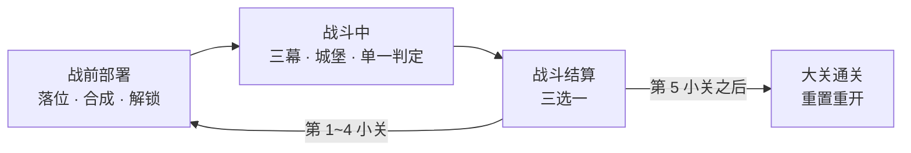
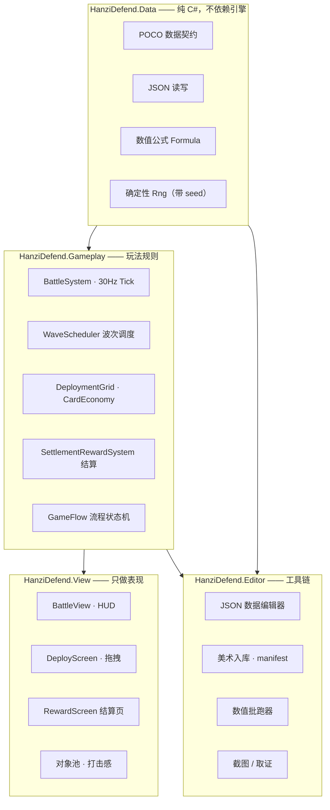

# HanziDefend · 汉字·兵器三国

> 竖屏 Unity 2D **合成放置 + 自动战斗**。每个单位本身就是它名字的那个汉字 —— 在 7×7 阵地上摆兵器卡、
> 同名同级合成，然后看兵营源源不断地往三国城堡上压。

[English](README.md) · **简体中文**

| | |
|---|---|
| **引擎** | Unity `6000.3.11f1` + URP（2D Renderer） |
| **终点平台** | 微信小游戏（竖屏 1080×1920，PPU 100） |
| **当前里程碑** | **M1 · 完整战斗 Demo**：`部署 → 战斗 → 结算` 闭环，一大关 = 五小关 |
| **状态** | 从头到尾可玩。数值尚未收敛 —— 见 [已知缺口](#已知缺口) |
| **代码量** | 115 个文件、约 4.45 万行 C#（其中约 1.45 万行是测试） |

<table>
<tr>
<td width="50%"></td>
<td width="50%"></td>
</tr>
<tr>
<td align="center"><b>战前部署</b> —— 多种占格形状、四档合成等级</td>
<td align="center"><b>战斗中</b> —— 攻城火力砸在敌方城堡上</td>
</tr>
</table>

---

## 目录

- [三阶段循环](#三阶段循环)
- [玩法系统](#玩法系统)
- [伤害与克制](#伤害与克制)
- [单位总表](#单位总表)
- [工程架构](#工程架构)
- [工具链](#工具链)
- [测试](#测试)
- [怎么跑起来](#怎么跑起来)
- [仓库结构](#仓库结构)
- [已知缺口](#已知缺口)
- [路线图](#路线图)

---

## 三阶段循环

一个**大关** = 五个**小关**。金币、场上部署、已获 BUFF 在小关之间继承，大关整体重置。



<table>
<tr>
<td width="25%"></td>
<td width="25%"></td>
<td width="25%"></td>
<td width="25%"></td>
</tr>
<tr>
<td align="center">1 · 开局只解锁正中 3×3</td>
<td align="center">2 · 到第 3 小关，场地已扩、BUFF 已攒</td>
<td align="center">3 · 胜利后三选一</td>
<td align="center">4 · 五战告捷 → 大关通关</td>
</tr>
</table>

---

## 玩法系统

### 战前部署 —— 7×7 阵地，每格都是兵营

场地固定 **7×7**，开局解锁正中 **3×3**，之后靠解锁卡逐格扩建（7 种形状：1×1、2×1、1×2、2×2、
缺角 2×2、3×1、1×3）—— 可以花金币买、可以从手牌里抽到、每小关也白送一张。

兵器卡按真实占格摆放，其中有**两个 L 形单位**（`弩车` 缺右上角、`冲车` 缺左下角）：美术按真实缺角
裁切后再拼回一张连续图，而不是拆成几块散着画。拖拽时用颜色直接告诉你结论：

<table>
<tr>
<td width="25%"></td>
<td width="25%"></td>
<td width="25%"></td>
<td width="25%"></td>
</tr>
<tr>
<td align="center">绿 —— 可落位</td>
<td align="center">金 —— 与下面那张合成</td>
<td align="center">红 —— 被别的单位挡住</td>
<td align="center">灰 —— 这格还没解锁</td>
</tr>
</table>

把一张卡拖到同 id 同等级的卡上即合成升一档：**绿 → 蓝 → 紫 → 金**。

**每个占用格是兵营，不是一次性出兵口。** 首次出兵等该单位自己的 `cooldown`，之后**按同一个冷却持续
出兵，不等前一个死**。防无限堆叠靠的是按占格分档的**每格同时存活上限**（1 格 → 4 只、2 格 → 2 只、
3 格及以上 → 1 只；光环单位硬性 1 只），外加全局 60 个我方场上实体上限。

### 战斗中 —— 三幕、一座城堡、一次判定

* 固定步长 **30Hz**：`BattleSystem.Tick(1/30f)` 是测试代码能连着调 N 次的公开方法，玩法逻辑一行都不
  埋在 `Update()` 里，表现层在其之上做插值。
* 波次是**生成物**不是手写的：三幕分别 26s / 32s / 42s，幕间留 6s 空窗，每幕有自己的护甲配比与压力
  系数。五个小关当前分别是 21 / 30 / 37 / 36 / 35 波。
* 敌方**城堡**（`城`）不是被动基地 —— 它会开火（伤害 60、射程 7、穿透 30），在第三幕首波登场。
* 索敌是纯 C# 确定性空间桶，0.2s 节流一次重定向并做相位错开；战斗实体不挂 `Rigidbody2D` /
  `Collider2D`。
* **胜负只有一个出口**：`TrySettle()` 判定后立即冻结 tick，不会出现第二次判定结果。
* 已实现的单位特性：`冲锋 Charge`、`践踏 Trample`、`穿透射击 PiercingShot`、`死亡掉卒 DeathSpawn`、
  `火焰光环 FireAura`、`冰霜光环 IceAura`。
* 击杀掉金币（普通 1 / 精英 3 / BOSS 20），直接供给下一轮部署消费。

### 战斗结算 —— 三张里挑一张

胜利后发三张，权重 85 被动 BUFF / 15 主动技能。每张可**免费重随一次**，再通过 Mock 激励视频
（`MockAdService`）多重随一次 —— 商业化形状先接好，SDK 以后再上。

技能与 BUFF 是**数据不是代码**：一个效果就是一串指令
（`AddStat`、`Heal`、`Damage`、`GrantShield`、`SpawnUnit`、`ModifyCoins`）配一个目标选择器
（`SelfUnit`、`AllyAll`、`AllyAdjacent`、`EnemyNearest`、`EnemyInRadius`、`EnemyBase`），由 C# 解释器
执行。这就是 M1 的热更方案：数值与技能平衡以 JSON 形式下发。

---

## 伤害与克制

伤害刻意分两层：**乘算**的「攻击类型 × 护甲类型」矩阵负责离散克制，**加算**的对位加伤负责微调 ——
加算不会让倍率指数爆炸。

```
typeMult = 矩阵[被击方护甲类型][攻击方攻击类型]
伤害     = max(最小伤害, (atk × typeMult + bonusVs) × armorScale / (armorScale + 护甲 - 穿透))
```

| 护甲 ↓ / 攻击 → | 劈砍 Slash | 打击 Blunt | 弓箭 Arrow | 攻城 Siege |
|---|:--:|:--:|:--:|:--:|
| **无甲 Unarmored** | ×2.0 | ×0.5 | ×2.0 | ×0.5 |
| **轻甲 Light**     | ×1.5 | ×1.0 | ×1.0 | ×1.0 |
| **重甲 Heavy**     | ×0.5 | ×2.0 | ×0.5 | ×4.0 |
| **建筑 Building**  | ×0.5 | ×1.0 | ×0.25 | ×2.0 |

上面每一个数都写在 `Assets/GameData/economy.json` 里，C# 里没有硬编码。

---

## 单位总表

**我方 14 个单位**、敌方 3 种杂兵、1 个 BOSS、2 个指挥官，全部定义在 `Assets/GameData/units.json`。

| 单位 | 占格 | 兵种 | 护甲 | 攻击 | 血量 | 伤害 | 射程 | 特性 |
|---|:--:|---|---|---|--:|--:|--:|---|
| 卒 `zu` | 1×1 | 步兵 | 无甲 | 劈砍 | 70 | 14 | 0.9 | — |
| 弓 `gong` | 1×1 | 步兵 | 无甲 | 弓箭 | 90 | 22 | 4.5 | — |
| 火 `huo` | 1×1 | 特殊 | 轻甲 | — | 120 | — | — | 火焰光环 |
| 冰 `bing` | 1×1 | 特殊 | 轻甲 | — | 120 | — | — | 冰霜光环 |
| 长矛 `mao` | 1×2 | 步兵 | 无甲 | 劈砍 | 260 | 33 | 1.4 | — |
| 肉盾 `dun` | 2×1 | 步兵 | 轻甲 | 打击 | 900 | 24 | 0.9 | — |
| 大刀 `dao` | 2×1 | 步兵 | 轻甲 | 劈砍 | 420 | 95 | 1.1 | — |
| 轻骑 `qqi` | 2×1 | 骑兵 | 轻甲 | 劈砍 | 480 | 62 | 1.0 | 冲锋 ×2 |
| 弩兵 `nub` | 1×2 | 步兵 | 无甲 | 攻城 | 330 | 85 | 5.5 | 穿透射击 |
| 重骑兵 `zqi` | 3×1 | 骑兵 | 重甲 | 劈砍 | 1150 | 45 | 1.1 | 践踏 |
| 铁甲兵 `tie` | 2×2 | 步兵 | 重甲 | 劈砍 | 1600 | 130 | 1.2 | — |
| 链甲兵 `lia` | 2×2 | 步兵 | 重甲 | 打击 | 1600 | 130 | 1.2 | — |
| 弩车 `nuc` | 2×2 缺角 | 特殊 | 无甲 | 攻城 | 700 | 260 | 7.0 | 穿透射击 |
| 冲车 `chc` | 2×2 缺角 | 特殊 | 重甲 | 攻城 | 1000 | 300 | 1.5 | 死亡掉 3 卒 |

敌方：狼 `e_lang`（快、脆）、流寇 `e_liu`、山贼 `e_shan`。BOSS：城 `bld_cheng`（3600 血、40 甲、
会开火）。指挥官：刘备（被动 *仁德* 全体 +10% 攻击，主动 *仁心济世* 全体回 100 血）与敌方吕布。

---

## 工程架构



四条红线（见 [`AGENTS.md`](AGENTS.md)）：

1. **玩法规则不许写进 View 层。** View 不做任何数值计算或胜负判断。
2. **胜负判定只有一个出口。** `TrySettle()` 判定后立即冻结 tick。
3. **数值只写在 JSON。** `Assets/GameData/*.json` 是唯一真源，代码里不硬编码数值。
4. **随机一律走带 seed 的 `Data.Rng`。** 禁用 `UnityEngine.Random`，保证 bug 可复现、批跑可对拍。

由「要能无头批跑」推出的两条架构要求：`BattleSystem.Tick(float dt)` 必须能被测试连续调用；场景**由代码
装配** —— `Battle.unity` 里只有三个对象（`Main Camera`、`Canvas`、`Bootstrap`），其余全部在 `Awake`
里搭出来，因此不会有场景合并冲突、不会丢引用。美术按约定路径 + 自动生成的 `art_manifest.json` 绑定，
Inspector 里一个引用都不用拖。

---

## 工具链

| 工具 | 位置 | 作用 |
|---|---|---|
| **JSON 数据编辑器** | `HanziDefend/Data Editor` | `JSON ⇄ 影子 ScriptableObject ⇄ 原生 Inspector`，带 schema 校验与保存前 diff 预览。影子 SO 不入库，JSON 始终是真源。 |
| **美术入库管线** | `Tools/art_intake.py`、`HanziDefend/Art/Regenerate Manifest` | 白底转 alpha、命名与比例校验、图集友好导入设置，并生成 `art_manifest.json`。全程不用手拖引用。 |
| **美术底校验器** | `HanziDefend/Validate Unit Art Backgrounds` | 同时按「外圈不透明像素比」和「画面覆盖率」两个指标判定 —— 第二个指标是实测加的：只看第一个会放过弩车。 |
| **数值批跑器** | `HanziDefend/Balance/Run (25 · 100 per Cohort)` | 参考阵容 × N 局无头批跑，多进程并行，产出 CSV + Markdown 报告，并跑一套冻结的验收评估（胜率、时长、护甲配比、前线指标、难度单调性）。 |
| **波次生成器** | `HanziDefend/Balance/Regenerate Waves` | `waves.json` 是生成物：输入幕长、压力系数、护甲配比，输出 21~37 波。 |
| **取证截图工具** | `HanziDefend/Screenshot`、`Capture Battle Review`、`Capture Queue Review`、`Capture Deploy Drag States` | 确定性 1080×1920 截图 —— 本 README 里的每一张图都出自它们。 |
| **图集与性能门禁** | `SpriteAtlasGenerator`、PlayMode 性能测试 | 图集构建，外加帧时间 / GC / 单位规模扩展性门禁。 |
| **MCP for Unity** | `com.coplaydev.unity-mcp` | 本项目是 agent-first 开发：派单、验收、编辑器自动化全部走 MCP。 |

---

## 测试

`Assets/Scripts/Tests` —— EditMode 14 个文件 + PlayMode 20 个文件，约 1.45 万行：

* **409** 个 `[Test]` 方法、**216** 条 `[TestCase]` 参数化用例、**6** 个 `[UnityTest]` 协程测试。
* EditMode 覆盖：配置加载与 schema、公式与 Rng 确定性、部署网格、手牌经济、结算发牌、美术管线、批跑器。
* PlayMode 覆盖：战斗遭遇、单位特性、机制扩展、HUD、拖拽事件链、卡面层级 / 形状 / 名字渲染、流程状态机、
  打击感反馈、对象池。
* 性能测试断言帧时间、GC 分配、重定向相位错开，以及 200→400 单位的扩展性。

这里的回归测试是**可证明有承重**的：工单里会记录「把修复塞回旧实现会红几条」（例如 WO-C11：新增 24 条
里红 13 条）。

---

## 怎么跑起来

```bash
git clone https://github.com/Mustenaka/HanziDefend.git
```

1. 用 **Unity 6000.3.11f1** 打开工程（需要 Git LFS —— 美术与截图都走 LFS）。
2. 打开 `Assets/Scenes/Battle.unity` 按 **Play**，`Bootstrap` 会把整个游戏搭出来。
3. 进来是部署阶段，把卡拖到阵地上，然后点 **战斗**。
4. 战斗中 `AUTO`/`MANUAL` 切换自动推进、`STEP` 单步推一个 tick —— 和测试用的是同一条手动步进路径。
   `M1GameBootstrap.SimulationSpeed` 默认 `8×`，方便快速验证。

常用命令都在 Unity 菜单栏的 **`HanziDefend/`** 下面。

---

## 仓库结构

```
Assets/
  GameData/        units · commanders · waves · levels · effects · economy · art_manifest（JSON）
  Scripts/
    Data/          [HanziDefend.Data]      纯 C#：数据契约、JSON、公式、确定性 Rng
    Gameplay/      [HanziDefend.Gameplay]  战斗、部署、结算、GameFlow
    View/          [HanziDefend.View]      战斗表现、部署页、HUD、对象池、反馈
    Editor/        [HanziDefend.Editor]    数据编辑器、美术管线、批跑器、截图
    Tests/         EditMode · PlayMode · Performance
  Art/             单位 · 指挥官 · 建筑 · 图标 · 特效 · 图集
  Scenes/          Battle.unity（只有 3 个对象，其余由代码装配）
Docs/
  Plan/            里程碑范围、工单总表、决策日志、技术债、审核报告
  Art/             美术规范：画布尺寸、命名、入库管线、资产状态
  Note/            上游需求拆解
  Images/          本 README 用到的截图
Tools/             Python 美术入库管线
```

文档地图：[`Docs/Plan/M1-00-总体方案.md`](Docs/Plan/M1-00-总体方案.md)（范围与架构）·
[`Docs/Plan/M1-01-工单总表.md`](Docs/Plan/M1-01-工单总表.md)（工单状态看板）·
[`Docs/Plan/M1-04-单位设计与数值.md`](Docs/Plan/M1-04-单位设计与数值.md)（克制系统与单位数值）·
[`Docs/Art/README.md`](Docs/Art/README.md)（美术规范与资产状态）。

---

## 已知缺口

照工单看板如实记录：

* **数值尚未收敛。** 仓库里最新那份 100 局批跑报告
  （[`WO-F1-Results/report.md`](Docs/Plan/REVIEW/WO-F1-Results/report.md)）读数是：小关 1 胜率 92%、
  小关 5 胜率 44%、两条无器械路线 0%，目标区间是 55~75%。WO-F4 的 §A/§B/§C（收敛与收口）还没开工；
  而且那份报告早于「部署格改兵营」的改动，DPS 口径需要重测。
* **合成目前零收益。** `units.json` 里 153 条成长曲线全是 `0.0`，等级 2 的面板等于等级 1 —— 绿→金
  这条四档进阶在 WO-F2 落地之前只是外观差异。
* **美术只完成一部分。** 21 张角色图完成 15 张；`弩车` 与一张指挥官立绘仍是占位；22 个图标里 20 个待审。
* **没有局外层。** 无存档持久化、无局外养成、无后端、无真实广告 SDK、未做微信打包 —— 全部推到 M2/M3。
* **音频只有调用点。** 有占位生成器和调用点，没有正式音频资源。
* **贴图未压缩。** 图集已经建起来，压缩留到真机构建时再收紧。

---

## 路线图

* **M1（当前）** —— 战斗 Demo：部署 / 战斗 / 结算闭环、一大关五小关、一套自产美术。
  剩余：数值收敛、合成收益。
* **M2** —— 存档持久化、局外养成、后端；并在有真实 WebGL spike 之后再评估逻辑热更
  （xLua / HybridCLR），不预先押注。
* **M3** —— 分路地图与卡桥、建筑卡（箭塔 / 拒马）、空地分层（数据里已留 `layer` 字段）、
  真实广告 SDK、微信打包。

---

## 致谢

策划、美术方向与工程：[@Mustenaka](https://github.com/Mustenaka)。
单位与指挥官美术由 AI 生成后人工筛选，走 [`Docs/Art/README.md`](Docs/Art/README.md) 里记录的入库管线。
